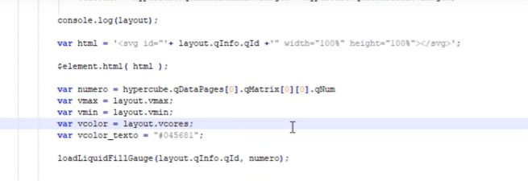
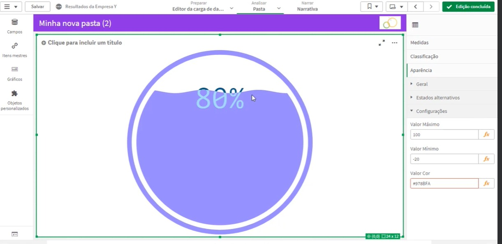

## Como Desenvolver Extensões do Qlik Sense com D3.js: Testando a Extensão D3 no HTML

### 1 - Introdução

Desenvolver extensões para o Qlik Sense com D3.js permite criar visualizações personalizadas que aproveitam o poder da biblioteca D3 para manipulação de dados e gráficos. Este guia passo a passo mostrará como testar uma visualização D3 em HTML, importá-la para o Qlik Sense, personalizá-la com dados do Qlik, adicionar um segundo indicador como linha de referência, e criar configurações personalizadas editando o CSS através do Javascript.

### 2 - Testando a Visualização D3 no HTML

Vamos testar, explorar e preparar a nossa visualização D3 antes de importá-la para o Qlik Sense como uma extensão.

#### Passo a Passo:

1. **Copiar o Código HTML**:
   - Primeiro, copie todo o código HTML da visualização D3 e cole no arquivo `Test.html`.

2. **Baixar Arquivos Necessários**:
   - No topo do código HTML, há links para os arquivos necessários para a visualização funcionar. Você precisa baixar esses arquivos salvando suas referências e adicionar à pasta da extensão.

3. **Organizar o CSS**:
   - Corte o código CSS que está entre as tags `<style>` no HTML e cole no arquivo vazio `original.css` que você baixou no artigo introdutório. Depois, remova as tags `<style>` do HTML.

4. **Atualizar Links no HTML**:
   - Altere as tags `<link>` no topo do HTML para referenciar os arquivos locais em vez dos links online:
     ```html
     <link rel='stylesheet' type='text/css' href="googleplay.css">
     <link rel='stylesheet' type='text/css' href="originald3.css">
     <script type="text/javascript" src="d3.min.js"></script>
     <script type="text/javascript" src="pointerevents.js"></script>
     <script type="text/javascript" src="pointergestures.js"></script>
     <script type="text/javascript" src="iopctrl.js"></script>
     ```

5. **Estrutura da Pasta de Extensão**:
   - Certifique-se de que a pasta da extensão contenha todos os arquivos necessários. Deve estar semelhante a esta estrutura:
     ```
     extension-folder/
     ├── googleplay.css
     ├── originald3.css
     ├── d3.min.js
     ├── pointerevents.js
     ├── pointergestures.js
     ├── iopctrl.js
     └── Test.html
     ```

6. **Executar o HTML no Navegador**:
   - Execute o arquivo `Test.html` em um navegador para verificar se a visualização D3 está funcionando antes de importá-la como uma extensão no Qlik Sense.

7. **Explorar e Modificar o Código**:
   - Aproveite esta oportunidade para entender como o código funciona e alterar suas variáveis para ver o impacto na visualização. Por exemplo, encontre a linha:
     ```javascript
     gauge.value(92);
     ```
   - Alterando o valor `92` para o valor da `medida` (cáculo do indicador extraido do QLIK SENSE) e atualizando a página `Test.html` no navegador, você verá o indicador do medidor mudar para `medida`.

Agora que temos todos os nossos arquivos D3 e a área de testes pronta, no próximo passo, começaremos a importar a visualização D3 para o Qlik como uma extensão.

### 3 - Importando a Visualização D3 no Qlik Sense

   <p align="center">
     
      

### 6 - Criando Configurações Personalizadas Editando o CSS com Javascript

   <p align="center">
    

### 4 - Personalizando o D3 com Dados do Qlik

   <p align="center">
    
